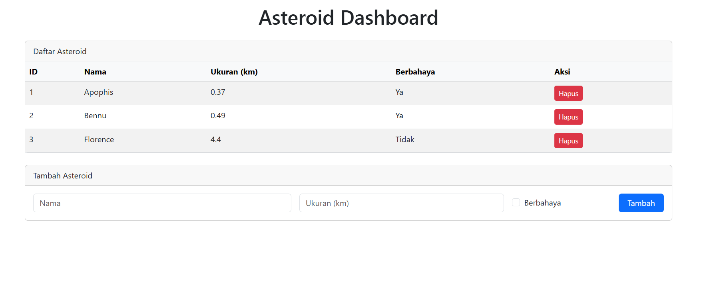

# Asteroid Dashboard \& API


Aplikasi sederhana untuk mengelola data asteroid dengan backend Flask + PostgreSQL dan frontend dashboard berbasis Bootstrap.


---


## Fitur


- Menampilkan daftar asteroid dari database PostgreSQL

- Menambah asteroid baru lewat form dashboard atau API

- Menghapus asteroid berdasarkan ID

- API RESTful lengkap untuk integrasi data asteroid

- Dashboard Bootstrap yang responsif dan mudah digunakan


---


## Teknologi


- Python 3.x

- Flask

- Flask SQLAlchemy

- Flask-CORS

- PostgreSQL

- Bootstrap 5

- dotenv untuk konfigurasi environment


---


## Setup & Running


### 1. Clone repo


```bash

git clone https://github.com/jimbotake/asteroid-dashboard-api.git

cd asteroid-dashboard-api

```


### 2.Buat environment (opsional pakai conda)


```bash

conda create -n asteroid-api python=3.10 -y

conda activate asteroid-api

```


### 3. Install dependencies

```bash

pip install -r requirements.txt

```


### 4. Buat file .env

isi dengan konfigurasi DB Postgre

```env

DB\_USER=postgres

DB\_PASSWORD=password123

DB\_HOST=localhost

DB\_PORT=5432

DB\_NAME=asteroid\_db

```


### 5. Jalankan aplikasi Flask

```bash

flask run

```

atau

```bash

python app.py

```

### 6. Buka Dashboard di browser

http://127.0.0.1:5000/

## Tampilan Aplikasi



---


